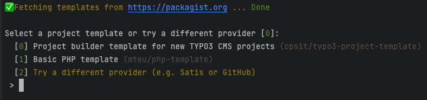

<div align="center">

# Project Builder Template

[](https://github.com/mteu/php-template/actions/workflows/cgl.yaml)
[](https://packagist.org/packages/mteu/php-template)
[](LICENSE.md)

📦&nbsp;[Packagist](https://packagist.org/packages/mteu/php-template) ·
💾&nbsp;[Repository](https://github.com/mteu/php-template) ·
🪲&nbsp;[Issue tracker](https://github.com/mteu/php-template/issues)

</div>

This is a framework-agnostic [Project Builder](https://github.com/CPS-IT/project-builder) template with a relatively basic initial setup. It facilitates a swift and easy-to-use creation
of Composer based PHP projects.

## 🚀 Features
* Static code analysis template with [PHPStan](https://phpstan.org/)
* Automatic code migration with [Rector](https://getrector.com/)
* Pre-defined GitHub actions for CGL and releases

## 🔥 Getting started
1. Create a new project:

   ```bash
   composer create-project cpsit/project-builder <target-directory>
   ```

2. [Project Builder](https://github.com/CPS-IT/project-builder) will automatically fetch and list available templates on `Packagist.org`.
3. Select the package `mteu/basic-project-template`.

   

4. Follow the instructions and answer a few questions and you're good to go.

> 💡 Please refer to the official Project Builder [documentation](https://project-builder.cps-it.de)
> to learn about alternative ways to create your project.

## 👩‍💻:🧑‍💻 Contribution
We welcome your feedback and ideas! One quick ask, though: Please do consult [`CONTRIBUTING.md`](CONTRIBUTING.md) before
proposing a PR. Thanks!

## 💛 Acknowledgement
This template is heavily based on the preparatory work done by [@eliashaeussler](https://github.com/eliashaeussler) and
me in the [TYPO3 Template Package](https://github.com/CPS-IT/typo3-project-template).

## ⭐ License
This project template is licensed under [GNU General Public License 3.0 (or later)](LICENSE.md).
